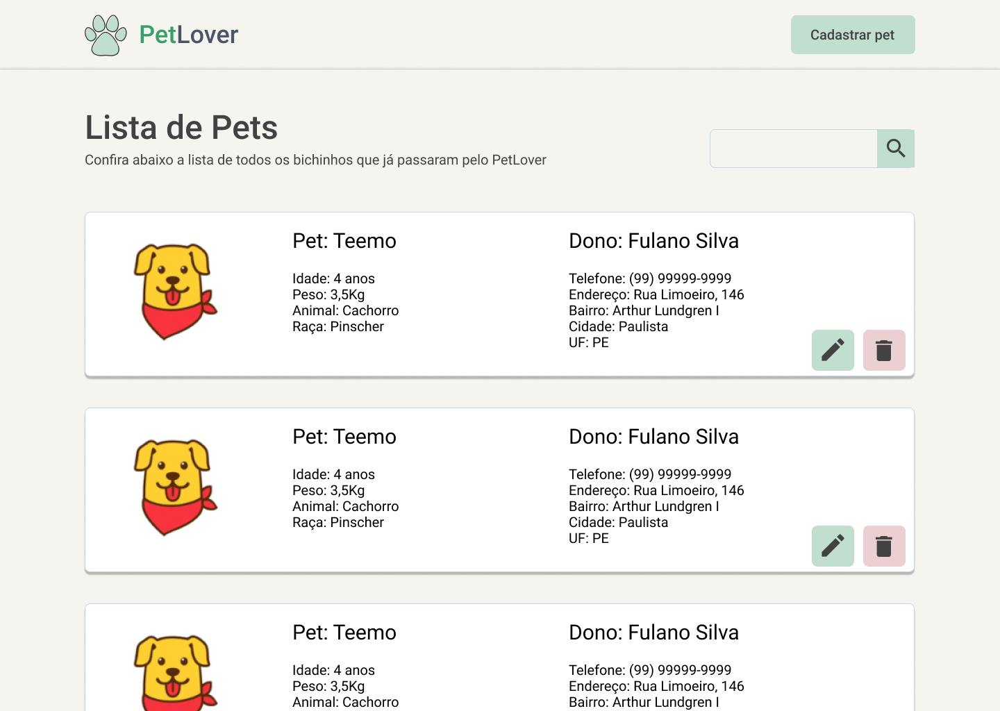
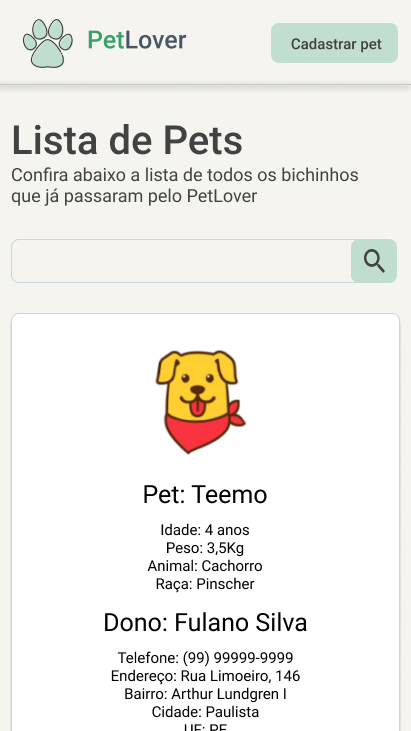
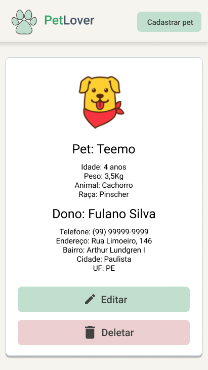

 

# Desafio - Desenvolvedor Fullstack Júnior
    


&nbsp;
- [Desafio - Desenvolvedor Fullstack Júnior](#desafio---desenvolvedor-fullstack-júnior)
  - [⭐ Features](#-features)
    - [Frontend](#frontend)
    - [Backend](#backend)
  - [✔ Pré-requisitos](#-pré-requisitos)
  - [🔥 Tecnologias](#-tecnologias)
  - [🎲 Como iniciar a aplicação](#-como-iniciar-a-aplicação)
  - [📸 Screenshots](#-screenshots)
    - [💻 Desktop](#-desktop)
    - [📱 Mobile](#-mobile)
  - [👱‍♂️ Autor](#️-autor)


&nbsp;
## ⭐ Features

### Frontend
- [x] Cadastro, remoção e edição de pet
- [x] Sistema de busca

### Backend
- [x] Rotas de CRUD


&nbsp;
## ✔ Pré-requisitos
- [NodeJS](https://nodejs.org/en/)


&nbsp;
## 🔥 Tecnologias

- [Next.JS](https://nextjs.org/)
- [Express](https://expressjs.com/)
- [Sqlite3](https://www.sqlite.org/index.html)


&nbsp;
## 🎲 Como iniciar a aplicação

```bash

# Clone a aplicação
$ git clone https://github.com/julio-lemos/desafio-desenvolvedor-junior.git

# Instale as dependências do frontend
$ cd desafio-desenvolvedor-junior
$ cd frontend
$ yarn

# Logo após instale as dependências do backend
$ cd ..
$ cd backend
$ yarn

# Para iniciar o front na pasta frontend aberta digite o comando
$ yarn dev

# Para iniciar o back na pasta backend digite o comando
$ yarn start

```


&nbsp;
## 📸 Screenshots

### 💻 Desktop



&nbsp;
### 📱 Mobile




&nbsp;
## 👱‍♂️ Autor
Feito com muito ❤ por mim.