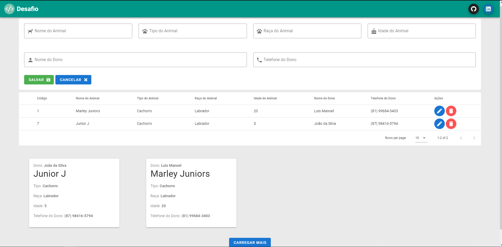

# Desafio



> Imagem do sitema final

### Instalação

Faremos as seguintes instalações e configurações

- Postgresql
- knex
- migrations

## 💻 Postgresql

Se não tiver o Postgresql instalado baixe no link abaixo. Recomendo que baixe a versão 12.

* <a href="https://www.enterprisedb.com/downloads/postgres-postgresql-downloads"> Postgresql </a>
* Após ter baixado e instalado, abra e clique em: PostgreSQL > Databases e clicando em databases crie um banco de dados com o nome: desafio.
* Depois de ter criado o banco de dados clique sobre ele para selecionar.

## 💻 Instalando as dependencias e o knex.

Abra as pastas frontend e backend no cmd e nas duas execute o comando `npm i`.

Agora no cmd onde está aberto a pasta backend execute o comando:
```
npm i -g knex
```

Ainda no cmd do backend execute o seguinte comando:
```
knex init
```

## 💻 Abra o projeto em um editor de códigos.

Vá até a o backend e abra um aquivo chamado de knexfile.js abra e cole o código abaixo:
- Não esqueça de mudar os campos de `database` caso tenha colocado outro nome no bd, e também edite os campos que contenham a `porta` (por padrão fica 5432) e depois o seu `user e password` do postgres.


```
module.exports = {

  client: 'postgresql',
  connection: {
    database: 'desafio',
    host : '127.0.0.1',
    port:   5432,
    user:     'postgres',
    password: 'root'
  },
  pool: {
    min: 2,
    max: 10
  },
  migrations: {
    tableName: 'knex_migrations'
  }
};
```

Agora volte no cmd do backend e execute o seguinte comando:

```
knex migrate:latest
```

- Com isso finalizamos a configuração do backend.


## 💻 Executando o projeto

- no `cmd do backend` execute o comando:
```
npm start
```

- no `cmd do frontend` execute o comando:
```
npm run serve
```

Após ter iniciado abra o cmd do frontend e copie o link para cessar o projeto no seu navegador.


