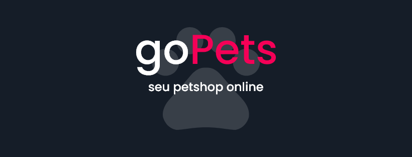

<h2 align="center">
  GoPets: Seu petshop online
</h2>
<p align="center">
  Gerencie o petshop da GoPets.
</p>

# GoPets

O projeto GoPets é um dashboard para gerenciar os pets da GoPets. Você pode criar novos pets e por uma tabela com paginação você também pode visualizar, alterar e excluir.

<hr>

<br />

- <a href="#tecnologias">Tecnologias 💻</a>
- <a href="#armazenamento">Armazenamento 🎲</a>
- <a href="#estilos">Estilos 💅</a>
- <a href="#responsividade">Responsividade 📱</a>
- <a href="#como-executar">Como executar 🚀</a>

<br />

<hr>

## Tecnologias

Backend:

- [NodeJS](https://nodejs.org/en/)
- [Express](https://expressjs.com/pt-br/)

Frontend:

- [ReactJS](https://pt-br.reactjs.org)

<br />

## Armazenamento

Para armazenar os dados foi utilizado o [LowDB](https://github.com/typicode/lowdb) - uma biblioteca que, através de um arquivo JSON, cria uma base de dados para ser utilizado em todo o app. Foi escolhido pela facilidade na hora de replicar o aplicativo, sem necessidade de instalação de um sistema de banco de dados.

<br />

## Estilos

Para realizar a estilização do App foi utilizado a estratégia de [Módulos CSS](https://github.com/css-modules/css-modules).

<br />

## Responsividade

O aplicativo foi feito para ser responsivo nas seguintes dimensões:

- 1440x900 (Original)
- 1024x768 (Laptop)
- 768x1024 (Tablet)
- 375x812 (Celular)

## Como executar

Siga as instruções de como executar o aplicativo.

1. Abra um terminal e clone o repositório: 

```
$ git clone https://github.com/matheuslanduci/gopets.git
```

2. Após clonar, navegue para a pasta:

```
$ cd gopets
```

3. Agora, através do yarn, instale as dependências (o comando irá instalar as dependências do Backend e do Frontend). Esse processo pode demorar.

```
$ yarn deps
```

4. Com as dependências instaladas, você pode iniciar o aplicativo. Esse processo pode demorar.

```
$ yarn start
```

5. Agora você pode acessar http://localhost:3333 e clicar no painel de Dashboard 🔥