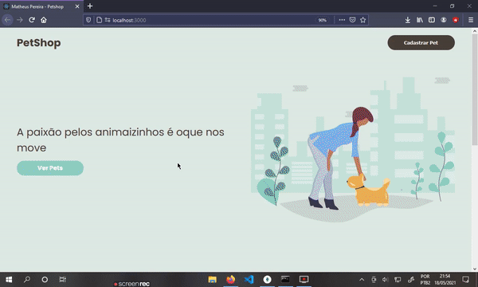

 

# Desafio - Desenvolvedor Fullstack Júnior
Seja bem-vindo! Este desafio foi projetado para avaliar a sua capacidade técnica como candidato à vaga de Desenvolvedor Fullstack Júnior.

## Proposta
Você deverá desenvolver um projeto no padrão MVC utilizando PHP ou Node.js com a finalidade de que seja possível listar, visualizar, criar, editar e excluir animais de estimação de uma petshop.

## Visualização

## Tecnologias utilziadas

✔️ Node.js na contrução da API e conexão com o banco de dados.
  
✔️ ReactJS para a contrução da interface.
  
✔️ Styled Components para a estilização;

✔️ MongoDB como bando de dados

## Instruções de como rodar a aplicação

- O banco de dados MongoDB deve estar conectado em sua porta padrão: 27017.
  
- Entrar na pasta "backend" e rodar o seguinte script: `npm run dev`, ele deverá inicializar o servidor, assim como o front-end simultaneamente.
  
- Após a inicialização de ambos, um banco de dados e uma coleção devem ser criadas automaticamente no MongoDB, e a porta localhost:3000 deve abrir no navegador.
  
- Prontinho, agora basta navegar pelo site e cadastrar um novo PET, após cadastrado ele poderá ser editado e também excluído. 😉

